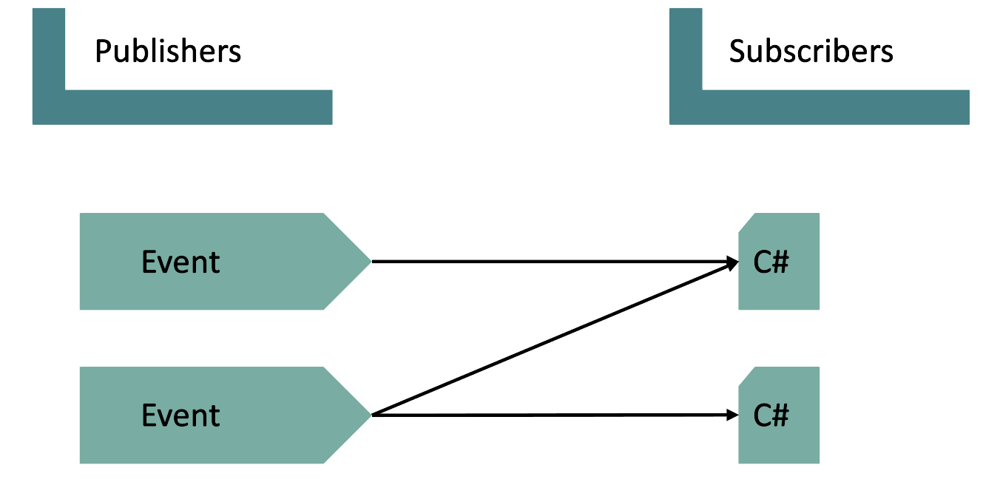
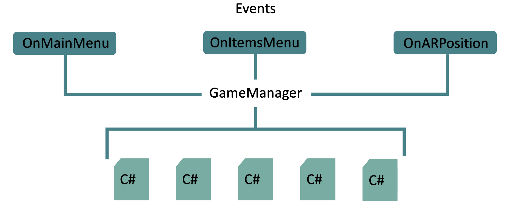

# Event Structure

## Definición
La arquitectura **Event Structure** (estructura de eventos) es un patrón de programación utilizado comúnmente en entornos como LabVIEW y en el desarrollo de aplicaciones interactivas. Su objetivo es gestionar eventos que ocurren durante la ejecución de un programa, como clics del usuario, cambios de variables o interacciones específicas.

## ¿Cómo funciona?
- Eventos definidos: Se configuran distintos eventos que la aplicación puede detectar (como presionar botones o mover un objeto en realidad aumentada).
- Manejo de eventos: Cuando ocurre un evento, el programa ejecuta el bloque de código correspondiente a ese evento.
- Ciclo de espera: El programa queda a la espera de nuevos eventos y responde dinámicamente, lo que mejora la eficiencia y la interactividad.

## ¿Por qué es útil para realidad aumentada?
- Respuesta en tiempo real: Permite reaccionar rápidamente a las acciones del usuario en un entorno de RA.
- Modularidad: Facilita la separación de tareas, como seguimiento de objetos, interacción y visualización.
- Eficiencia: Optimiza el rendimiento, evitando ejecuciones innecesarias.

## Diagrama de la aplicación

Cada que un evento es llamado, ejecuta uno o más scripts.

## ¿Cómo se aplica este patrón?

Dentro de la aplicación se tendrán tres vistas y al interactuar con alguna de ellas se dispara un evento el cual se escuchará y realizará el proceso asignado.