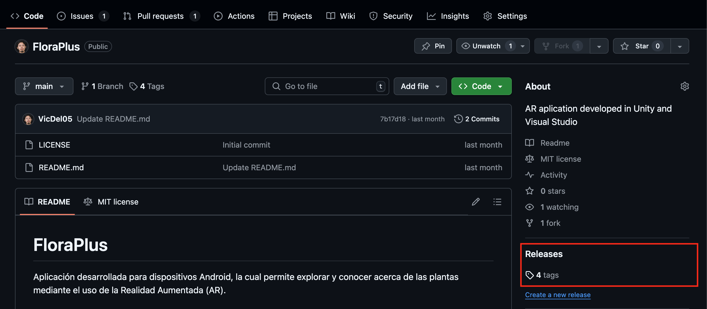
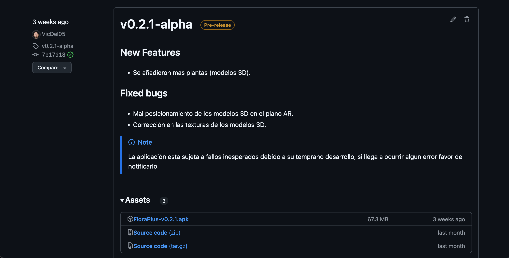

import repo from '../../static/img/IMG_8151.jpg'
import version from '../../static/img/IMG_8152.jpg'
import details from '../../static/img/IMG_8153.jpg'
import downloads from '../../static/img/IMG_8154.jpg'

# ¿Cómo instalar FloraPlus en mi dispositivo?

## Requisitos del dispositivo

- Versión de Android 11 o superior
- Espacio mínimo disponible en almacenamiento de 128MB
- Mínimo 4GB de RAM
- Conceder permiso del uso de la cámara

## LTS (Long-Term Support)
El archivo APK con la verión mas reciente se encuentra en el apartado de **Releases** en el [repositorio de GitHub](https://github.com/VicDel05/FloraPlus) del proyecto.

### En dispositivos móviles

Al ingresar al repositorio en la aplicación móvil, debe dirigirse a "releases".

Aqui se enlistarán las versiones existentes de la aplicación, la primera en la lista corresponde a la última versión disponible, sí desea instalar dicha versión seleccionela.

Dentro de la release se detallarán las características y novedades de la verión en cuestión.

En la parte inferior se encontrarán los descargables, en el apartado de assets estará el archivo APK que debe descargar para instalar la aplicación en su dispositivo móvil.

### Desde computadoras

Una vez dentro del apartado, aparecerá la última versión disponible con una breve descripción de las novedades y los bugs solucionados. 

En la parte inferior de las notas de la release se encuentran los descargables, descargar el archivo con extensión **.apk** (usualmente el archivo se nombrará con la siguiente nomenclatura: **FloraPlus-vX.Y.Z.apk**)

:::danger[Take care]

Hay que aclarar que estas versiones tienen funciones experimentales y pueden presentar fallos o bugs.

:::

## Regular version
Para descargar la versión regular de la aplicación dando clic en el botón de descarga

export const Btndownload = ({children, color}) => (
    

         {
                window.location.href = 'https://github.com/VicDel05/FloraPlus/releases/download/v1.0.0/FloraPlus-v1.0.0.apk'
            }}>
            {children}
        
    

);

<Btndownload color="#00cdac">Descargar</Btndownload>

Automaticámente se descargará el APK y se guardará en el almacenimiento de su dispositivo, debe dirigirse al gestor de archivos y ejecutar el APK.
