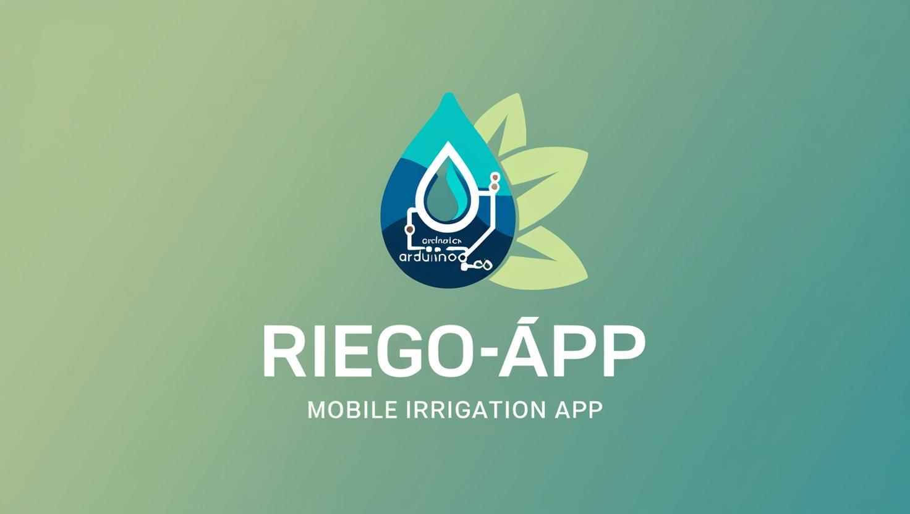

# Agradecimientos

El desarrollo del **Sistema de Riego Automático con Arduino y App** no habría sido posible sin el esfuerzo y dedicación de múltiples personas e iniciativas.  

Queremos expresar nuestro profundo agradecimiento a:  

- [José Enrique Martinez Ramirez](https://github.com/Enrique2125122) 
- [Victor Alfonso Delgado Bautista](https://github.com/VicDel05) 
- [Eder Osvaldo Robles Hernández](https://github.com/Osvaldo-1) 
- [Nombre](https://github.com/) 
- [Nombre](https://github.com/) 

## 🤖 Comunidad de Arduino  
A todos los desarrolladores, creadores de contenido y entusiastas de **Arduino** que han compartido su conocimiento y experiencias, facilitando el aprendizaje y la innovación en proyectos de automatización.  

## 📡 Especialistas en IoT y Electrónica  
Gracias a quienes han contribuido con su experiencia en **Internet de las Cosas (IoT)** y sistemas embebidos, ayudando a optimizar la comunicación entre la aplicación móvil y el hardware mediante Bluetooth.  

## 💧 Investigación sobre Riego Inteligente  
El proyecto se inspiró en investigaciones sobre **uso eficiente del agua** en la agricultura y jardinería, promoviendo prácticas sostenibles que benefician tanto a pequeños agricultores como a hogares urbanos.  

---

### **📌 Mejoras y personalización**  
🔹 **Enfocado en el sistema de riego**  
🔹 **Agradecimiento a la comunidad, investigadores y expertos**  
🔹 **Incluye un reconocimiento al desarrollador con su perfil de GitHub**  

🚀 ¡Déjame saber si quieres agregar algo más!

---

## 👤 Desarrollador  

🛠 **Creado por:** José Enrique Martínez Ramírez  
📌 **GitHub:** [@Enrique2125122](https://github.com/Enrique2125122)  

