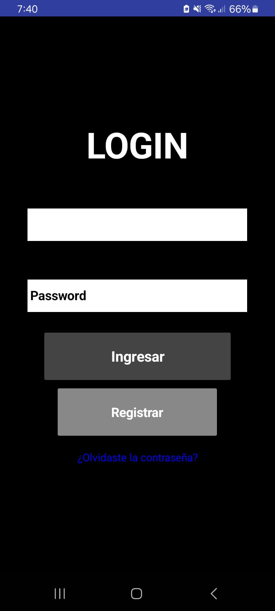
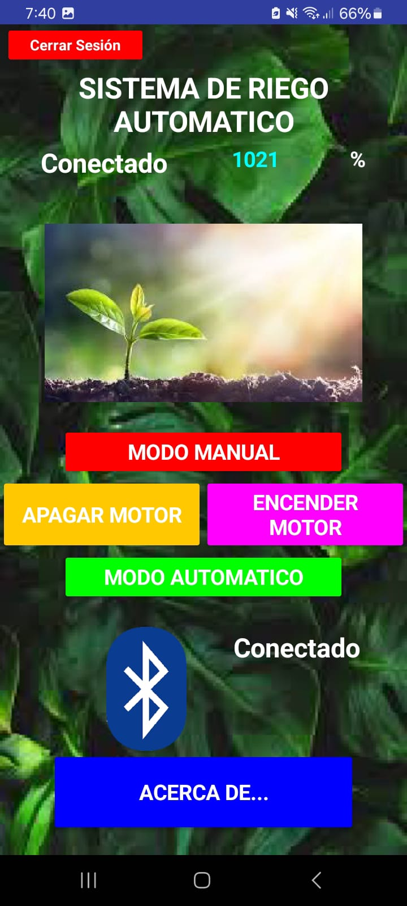

# Tutorial de APP-RIEGO
## Tutorial de Uso y Configuración de la App de Riego 🌱📱

### 1. Instalación y Requisitos Previos
Antes de empezar, asegúrate de que cumples con los siguientes requisitos:
- ✅ Tener la aplicación instalada en tu dispositivo móvil. [Descarga](https://github.com/tu-repo/riego-app)
- ✅ Contar con un módulo Bluetooth en el sistema de riego.
- ✅ Tener activado el Bluetooth en tu celular.

### 2. Inicio de Sesión (Si Aplica)
- 1️⃣ Abre la aplicación.
- 2️⃣ La app requiere inicio de sesión, ingresa tu usuario y contraseña y registrate.
- 3️⃣ Presiona "Iniciar sesión" para acceder a la interfaz principal.

### 3. Conexión con el Sistema de Riego 🌿🔗
- 1️⃣ Asegúrate de que el módulo Bluetooth del sistema de riego esté encendido.
- 2️⃣ En la aplicación, presiona el botón de "Conectar Bluetooth".
- 3️⃣ Aparecerá una lista de dispositivos disponibles, selecciona el módulo de riego.
- 4️⃣ Espera la confirmación de conexión.

### 4. Monitoreo de la Humedad 📊💧
- 📌 En la pantalla principal de la app, verás un indicador con el porcentaje de humedad actual del suelo.
- 📌 Si el porcentaje de humedad es bajo, la app puede recomendar activar el riego.
- 📌 Se actualiza en tiempo real conforme la humedad cambia.

### 5. Modos de Funcionamiento 🚀
La app tiene dos modos principales para el riego:

#### 🔹 Modo Automático
- ✅ Si activas esta opción, el sistema encenderá o apagará el motor automáticamente con base en los valores de humedad.
- ✅ Ideal para mantener un riego eficiente sin intervención manual.

Cómo activarlo:
- 1️⃣ Presiona el botón "Automático" en la aplicación.
- 2️⃣ Verás una confirmación de que el sistema manejará el riego según la humedad.

#### 🔹 Modo Manual
- ✅ En este modo, tú decides cuándo encender o apagar el motor.
- ✅ Útil si quieres un control más preciso del riego.

Cómo usarlo:
- 1️⃣ Presiona el botón "Manual".
- 2️⃣ Aparecerán botones para "Encender" y "Apagar" el motor.
- 3️⃣ Presiona "Encender" para activar el riego.
- 4️⃣ Presiona "Apagar" cuando ya no sea necesario regar.

### Solución de Problemas 🔧
❌ No se conecta el Bluetooth:
- ✅ Asegúrate de que el módulo de riego esté encendido.
- ✅ Verifica que el Bluetooth del celular esté activado.
- ✅ Prueba desconectar y volver a conectar el módulo.

❌ El motor no enciende en automático:
- ✅ Revisa si el umbral de humedad está correctamente configurado.
- ✅ Asegúrate de que el motor esté funcionando manualmente.